<div align="center">


# OpenNotebookLM

[](https://www.python.org/)
[](https://nodejs.org/)
[](LICENSE)
[](https://github.com/OpenDCAI/Open-NotebookLM)

English | [中文](README_ZH.md)

### Open-source NotebookLM Alternative

Transform your documents into interactive knowledge bases with AI-powered chat, note-taking, and one-click content generation

[Get Started](#-quick-start) · [Features](#-core-features) · [Documentation](#-project-structure) · [Community](#-community)

</div>

---

## 📅 Changelog

- **2026.03.11** — Code refactoring: strict layered architecture; integrated local TTS model ([Qwen3-TTS](https://huggingface.co/Qwen/Qwen3-TTS-12Hz-1.7B-CustomVoice)); added source-based note QA editing (Notion AI style); UI improvements; simplified configuration structure
- **2026.03.08** — Added user management: Supabase email + OTP authentication, multi-user data isolation, email-based user directories; cleaned up deprecated scripts
- **2026.02.27** — Integrated [Qwen-DeepResearch](https://github.com/Alibaba-NLP/DeepResearch) deep research module; PPT generation now supports Nano Banana 2 image model
- **2026.02.13** — Initial release

---

## 📸 Screenshots

<div align="center">
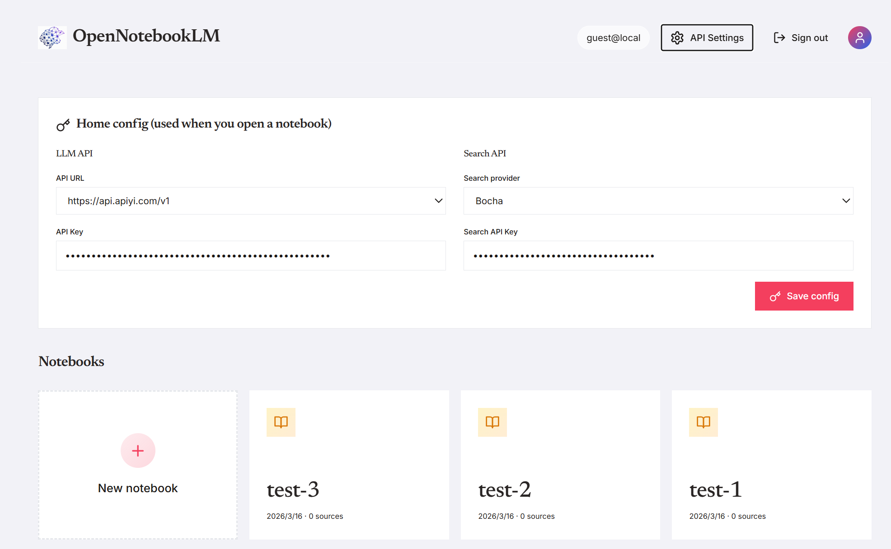
<p><em>Dashboard — Notebook management</em></p>
</div>

<div align="center">
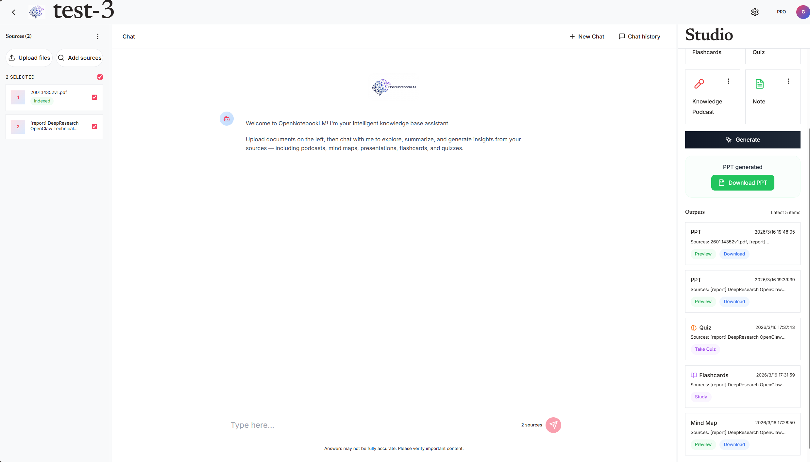
<p><em>Notebook workspace — Knowledge base + Smart QA + One-click generation</em></p>
</div>

<div align="center">
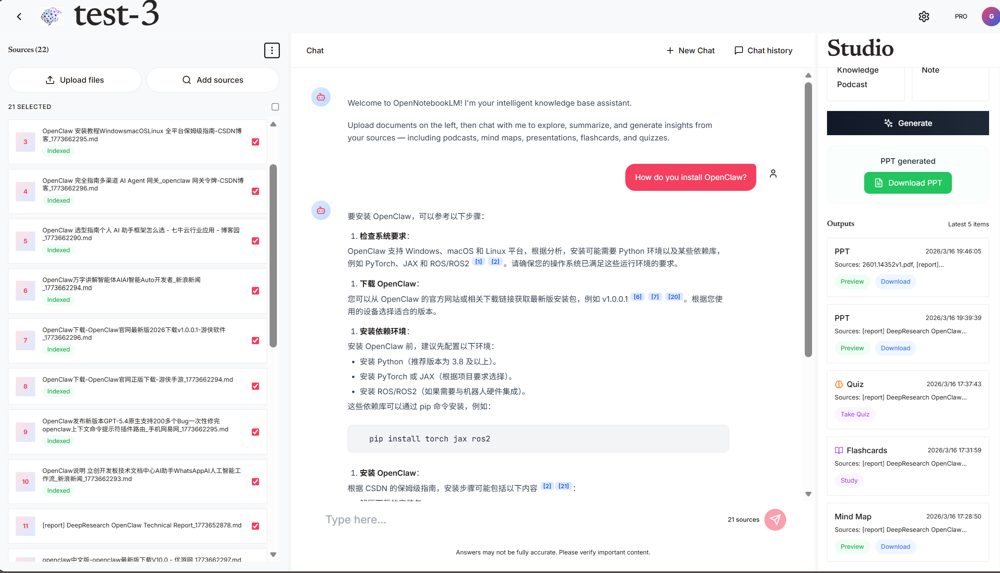
<p><em>Generation panel — Multiple output formats</em></p>
</div>

<div align="center">
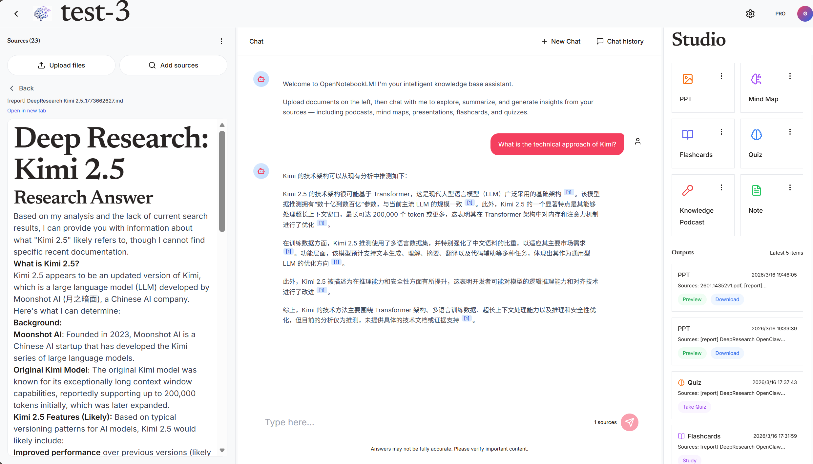
<p><em>Chat and knowledge base details</em></p>
</div>

<div align="center">
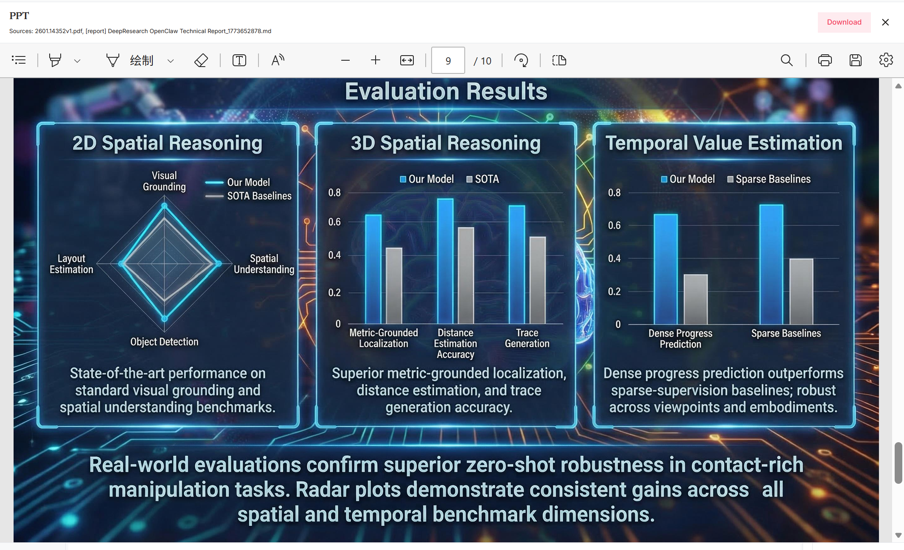
<p><em>PPT generation</em></p>
</div>

<div align="center">
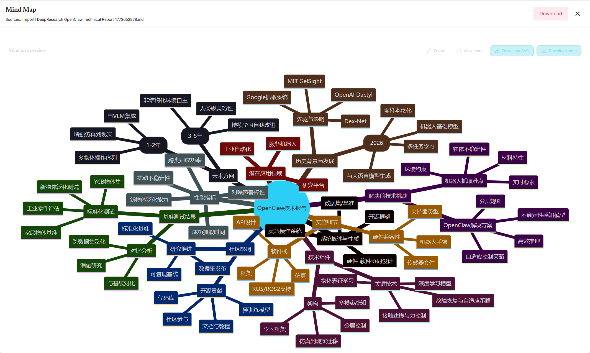
<p><em>Mind map</em></p>
</div>

<div align="center">

<p><em>DrawIO diagram — Inline editor</em></p>
</div>

<div align="center">
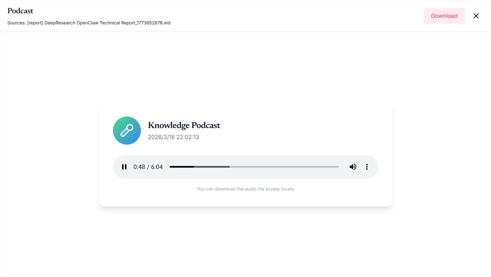
<p><em>Knowledge podcast</em></p>
</div>

<div align="center">
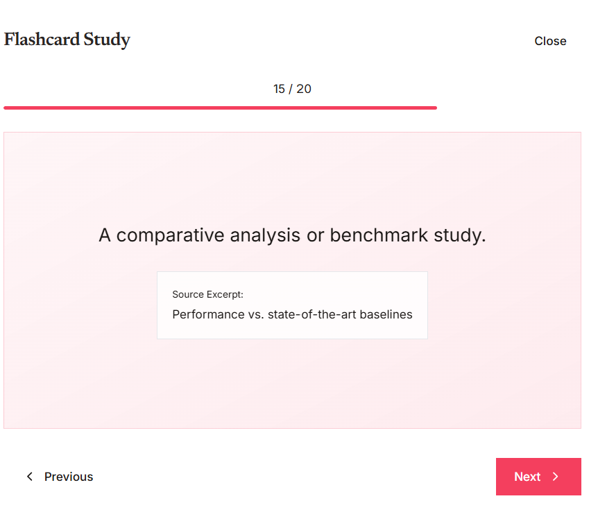
<p><em>Flashcard study</em></p>
</div>

<div align="center">
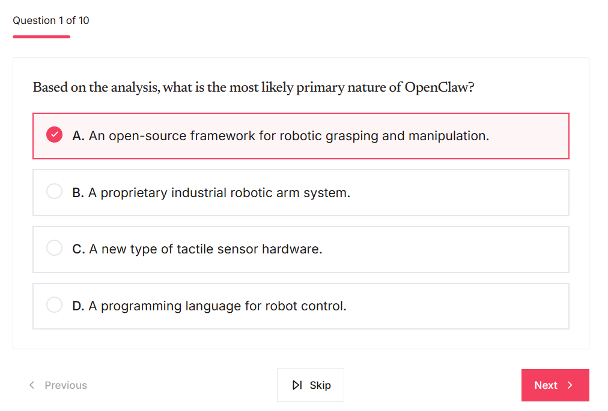
<p><em>Quiz</em></p>
</div>

<div align="center">
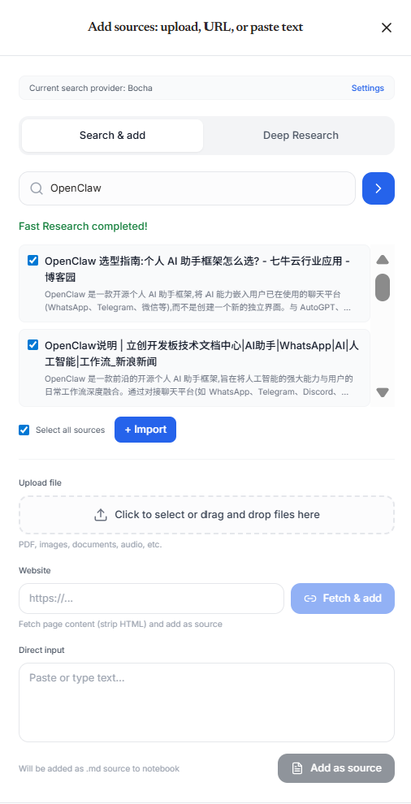
<p><em>Web search to import sources</em></p>
</div>

<div align="center">
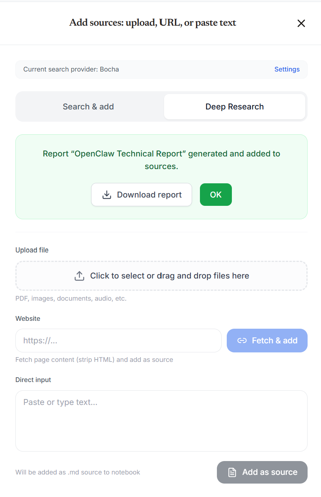
<p><em>Deep research report generation</em></p>
</div>

<div align="center">
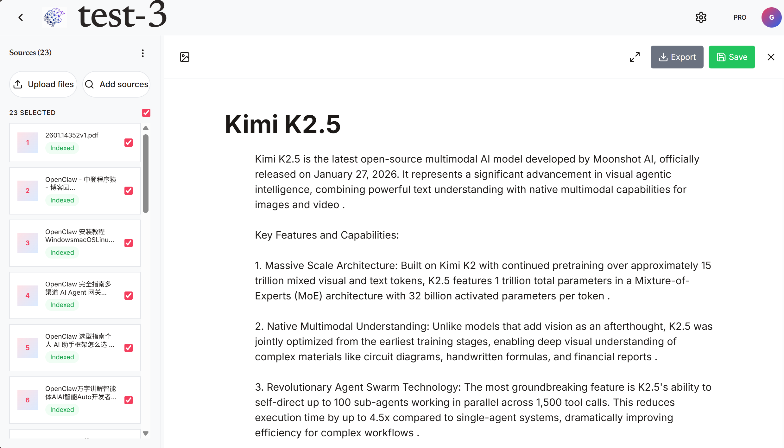
<p><em>Note editor — Notion-style block editor</em></p>
</div>

<div align="center">
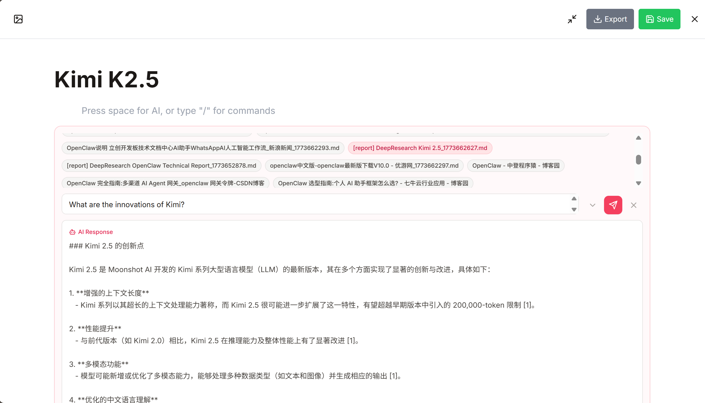
<p><em>AI-assisted writing — Polish, rewrite, explain</em></p>
</div>

<div align="center">
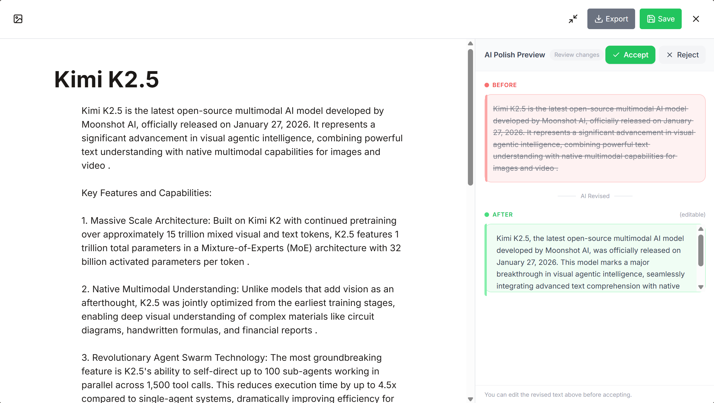
<p><em>AI polish — Enhance your writing</em></p>
</div>

<div align="center">
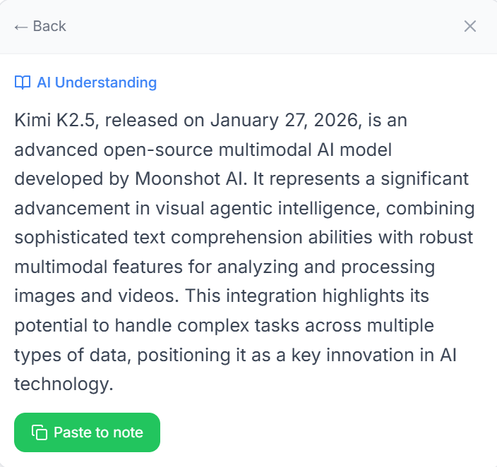
<p><em>AI explain — Understand complex content</em></p>
</div>

---

## ✨ Core Features

<table>
<tr>
<td width="50%">

### 📚 Knowledge Management
- **Multi-source Import**: PDFs, URLs, plain text, web search
- **Semantic Search**: Local embedding-based vector retrieval
- **Smart Organization**: Aggregate multiple sources into notebooks

### 💬 AI-Powered Interaction
- **RAG Q&A**: Context-aware answers grounded in your documents
- **Chat History**: Persistent conversation threads
- **Source Attribution**: Transparent reference tracking

### ✍️ Intelligent Note-Taking
- **Notion-Style Editor**: Block-based editing with Markdown support
- **AI Writing Assistant**: Polish, rewrite, explain, and generate
- **Rich Formatting**: Headings (1-6), lists, code blocks, quotes

</td>
<td width="50%">

### 🎨 Content Generation
- **Presentations**: Editable PPT slides from knowledge base
- **Mind Maps**: Mermaid diagrams with preview and export
- **Diagrams**: DrawIO charts with inline editor
- **Podcasts**: Script generation with TTS narration

### 📊 Learning Tools
- **Flashcards**: Auto-generated study cards
- **Quizzes**: Multiple-choice questions with scoring
- **Deep Research**: Web search + LLM synthesis reports

### 🔐 User Management
- **Authentication**: Supabase email + OTP verification
- **Multi-user Support**: Data isolation per user
- **Trial Mode**: Full functionality without login

</td>
</tr>
</table>

---

## 🚀 Quick Start

### 1. Clone & Install

```bash
git clone https://github.com/OpenDCAI/opennotebookLM.git
cd opennotebookLM

# Create virtual environment (Conda recommended)
conda create -n opennotebook python=3.11 -y
conda activate opennotebook

# Install Python dependencies
pip install -r requirements-base.txt
```

### 2. Configure API Keys

```bash
cp fastapi_app/.env.example fastapi_app/.env
```

Edit `fastapi_app/.env` with at least the following:

#### LLM API (Required)

The project calls LLMs via an OpenAI-compatible API. By default it uses [APIyi](https://www.apiyi.com) as a relay service (supports GPT / Claude / Gemini and more).

```env
# LLM API endpoint (OpenAI-compatible format)
DEFAULT_LLM_API_URL=https://api.apiyi.com/v1

# Your API key (obtain from APIyi or another LLM provider)
# Can also be configured dynamically in the frontend settings panel
```

> You can use any OpenAI-compatible API service (OpenAI official, Azure OpenAI, local Ollama, etc.) — just change `DEFAULT_LLM_API_URL`.

#### Search API (Required for web search features)

Web search and deep research report features require a search engine API. Any one of the following providers will work:

| Provider | Configuration | Sign up |
|----------|--------------|---------|
| **Serper** (recommended) | Env variable `SERPER_API_KEY` | [serper.dev](https://serper.dev) |
| **SerpAPI** | Pass `search_api_key` from frontend | [serpapi.com](https://serpapi.com) |
| **Google CSE** | Pass `search_api_key` + `google_cse_id` from frontend | [programmablesearchengine.google.com](https://programmablesearchengine.google.com) |
| **Brave Search** | Pass `search_api_key` from frontend | [brave.com/search/api](https://brave.com/search/api) |
| **Bocha** | Pass `search_api_key` from frontend | [open.bochaai.com](https://open.bochaai.com) |

Serper is configured via a backend environment variable. Other providers can be set in the frontend settings panel.

```env
# Serper (Google search), recommended
SERPER_API_KEY=your_serper_api_key
```

#### Supabase (Optional — User Management)

For multi-user authentication and data isolation. **If not configured or left empty, the system automatically enters trial mode** (no login required, single local user, all core features work normally).

When configured: email + password sign-up/login, OTP email verification, per-user data isolation (separate directories per user).

```env
# If you don't need multi-user features, you can delete or leave empty
SUPABASE_URL=https://your-project-id.supabase.co
SUPABASE_ANON_KEY=your_supabase_anon_key
SUPABASE_SERVICE_ROLE_KEY=your_supabase_service_role_key
```

#### TTS Voice Synthesis (Optional — Podcast Feature)

Podcast generation supports local TTS models. When enabled, it will automatically download the [Qwen3-TTS](https://huggingface.co/Qwen/Qwen3-TTS-12Hz-1.7B-CustomVoice) model (~3.4GB).

```env
# Enable local TTS (0=disabled, 1=enabled)
USE_LOCAL_TTS=1

# TTS engine: qwen (recommended) or firered
TTS_ENGINE=qwen

# Model idle auto-unload timeout (seconds, default 300 = 5 minutes)
TTS_IDLE_TIMEOUT=300
```

> **Tip**: If you don't need podcast features, set `USE_LOCAL_TTS=0` or delete this config to save disk space.

### 3. Start Backend

```bash
uvicorn fastapi_app.main:app --host 0.0.0.0 --port 8213 --reload
```

On startup, the backend automatically launches a local embedding service (Octen-Embedding-0.6B on port `26210` by default). The model is downloaded on first run. To disable local embedding, set `USE_LOCAL_EMBEDDING=0`.

- Health check: http://localhost:8213/health
- API docs: http://localhost:8213/docs

### 4. Start Frontend

Both English and Chinese frontends are provided — pick either:

```bash
# English frontend
cd frontend_en && npm install && npm run dev

# Chinese frontend
cd frontend_zh && npm install && npm run dev
```

Open http://localhost:3000 (or the port shown in the terminal).

> `npm run dev` uses each frontend's `vite.config.ts`, and the current default frontend port is `3000`.
> If you use the repository's `scripts/start.sh`, it starts the **Chinese frontend** on port `3001`, the backend on `8213`, and the cpolar tunnel together.

> The LLM API URL and API key can be changed dynamically in the settings panel (top-right corner) without restarting.

#### Frontend Configuration (Optional)

**For local deployment** (frontend and backend on the same machine): No configuration needed. The default setup works out of the box.

**For public deployment** (via cpolar/ngrok tunneling):

The frontend has built-in smart detection:
- When `.env` is set to `localhost` but accessed from a public URL, it automatically uses relative paths (current domain)
- In dev mode, Vite proxies `/api` and `/outputs` to the local backend at `http://localhost:8213`
- **Recommended**: Use nginx reverse proxy to unify frontend and backend under the same domain, no extra configuration needed

> **Note**: The ports shown here, such as `3000`, `3001`, `8080`, and `8213`, are example ports only. In a real deployment, replace them with the actual ports used by your frontend, backend, and proxy services.
> For personal testing or lightweight usage, `scripts/start.sh + Vite proxy + cpolar` is sufficient; for more stable public access or larger-scale deployments, nginx reverse proxy is still the recommended approach.
> In the current repository, `scripts/start.sh` uses `CPOLAR_TUNNEL_NAME=opennotebook` and prints the configured `CPOLAR_PUBLIC_URL`. If you change your reserved cpolar tunnel, update both variables in the script as well.

Create `frontend_zh/.env` (or `frontend_en/.env`):

```env
# Backend API base URL (for local development)
VITE_API_BASE_URL=http://localhost:8213
```

**Deployment comparison:**

| Deployment Type | Configuration | Description |
|----------------|---------------|-------------|
| **Local development** | `VITE_API_BASE_URL=http://localhost:8213` | Frontend and backend both run locally |
| **Using `scripts/start.sh`** | `VITE_API_BASE_URL=http://localhost:8213` | The current script starts the Chinese frontend on `3001`, backend on `8213`, and exposes the frontend through a named cpolar tunnel |
| **Public deployment (recommended)** | `VITE_API_BASE_URL=http://localhost:8213` | Use nginx reverse proxy for unified domain, smart detection auto-switches to relative paths |
| **Public deployment (separated)** | `VITE_API_BASE_URL=https://backend-xxx.cpolar.io` | Frontend and backend use different domains, requires manual backend URL configuration |

**Recommended: Use nginx reverse proxy for unified domain**

Create `nginx.conf`:

```nginx
server {
    listen 8080;

    # Frontend
    location / {
        proxy_pass http://localhost:3000;
        proxy_set_header Host $host;
        proxy_set_header X-Real-IP $remote_addr;
    }

    # Backend API
    location /api/ {
        proxy_pass http://localhost:8213/api/;
        proxy_set_header Host $host;
        proxy_set_header X-Real-IP $remote_addr;
    }

    # Backend output files
    location /outputs/ {
        proxy_pass http://localhost:8213/outputs/;
    }
}
```

If you are not running `npm run dev` directly and instead use the current repository's `scripts/start.sh`, change the frontend upstream above from `http://localhost:3000` to `http://localhost:3001`.

Then expose nginx port via cpolar:
```bash
cpolar http 8080
```

This way frontend and backend share the same domain, smart detection will automatically use relative paths without configuration changes. Replace the example ports with the real ports used in your environment.

> **Note**: After changing `.env`, rebuild the frontend (`npm run build`) or restart dev server (`npm run dev`).

---

## 📂 Project Structure

```
opennotebookLM/
├── fastapi_app/             # Backend API (FastAPI)
│   ├── routers/             #   Routes: KB, auth, Paper2PPT, Paper2Drawio, etc.
│   ├── services/            #   Business logic: search, flashcards, quizzes, etc.
│   ├── config/              #   Configuration & environment variables
│   ├── dependencies/        #   Dependency injection (auth, Supabase client)
│   ├── middleware/           #   Middleware (API key validation)
│   └── workflow_adapters/   #   Workflow adapter layer
├── workflow_engine/         # Workflow engine (DataFlow-Agent)
│   ├── agentroles/          #   Agent role definitions
│   ├── workflow/            #   Workflows (Paper2PPT, PDF2PPT, Image2Drawio, etc.)
│   ├── promptstemplates/    #   Prompt templates
│   └── toolkits/            #   Toolkits (search, parsing, etc.)
├── frontend_en/             # English frontend (React + Vite + Tailwind)
├── frontend_zh/             # Chinese frontend
├── database/                # Database migration scripts
├── docs/                    # Documentation
├── script/                  # Utility scripts (DB init, etc.)
├── static/                  # Static assets
└── outputs/                 # Generated file output directory (isolated by user email)
```

---

## ⚙️ Model Configuration

The project uses a three-layer model configuration system, from coarse to fine-grained:

1. **Base model layer** — Define available model names (`MODEL_GPT_4O`, `MODEL_CLAUDE_HAIKU`, etc.)
2. **Workflow layer** — Set default models per workflow (`PAPER2PPT_DEFAULT_MODEL`, etc.)
3. **Role layer** — Fine-grained control over each role within a workflow (`PAPER2PPT_OUTLINE_MODEL`, etc.)

See `fastapi_app/.env.example` for the full configuration reference.

---

## 🗺️ Roadmap

- [x] Knowledge base management (upload files / paste URLs / text)
- [x] RAG smart Q&A
- [x] PPT generation
- [x] Mind map generation
- [x] DrawIO diagram generation
- [x] Knowledge podcast generation
- [x] Flashcards & quizzes
- [x] Web search source import
- [x] Deep research reports
- [x] Local embedding vector retrieval
- [x] User management (Supabase email auth + multi-user isolation)
- [ ] Video generation (in progress)
- [ ] Video source import (in progress)
- [ ] Audio source import (in progress)

---

## 🤝 Contributing

Issues and pull requests are welcome. See [Contributing Guide](docs/contributing.md).

---

## 📄 License

[Apache License 2.0](LICENSE)

Generation features are built on [OpenDCAI/Paper2Any](https://github.com/OpenDCAI/Paper2Any).

---

<div align="center">

**If this project helps you, please give it a ⭐ Star**

</div>

---

## 💬 Community

<div align="center">

<p><em>Scan to join our WeChat group</em></p>
</div>
